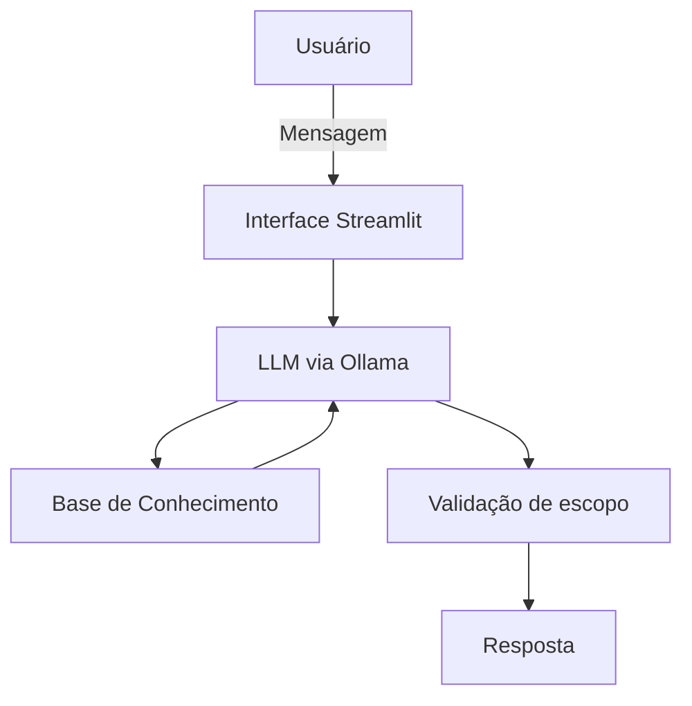

# 🤖 Edu — Educador Financeiro com IA Generativa

Protótipo de agente conversacional que ensina conceitos de finanças pessoais usando os dados do próprio cliente como exemplo — sem nunca recomendar onde investir. Desenvolvido como solução do desafio [Bia do Futuro](https://github.com/digitalinnovationone/dio-lab-bia-do-futuro) da Digital Innovation One.

## O que o Edu faz

- Explica conceitos financeiros (CDI, Tesouro Selic, reserva de emergência etc.) em linguagem simples
- Usa os dados mockados do cliente (perfil, transações, histórico de atendimento) para dar exemplos personalizados
- **Nunca recomenda investimentos específicos** — só explica como cada produto funciona, deixando a decisão com o usuário
- Admite quando não sabe algo, em vez de inventar resposta

## Persona

| | |
|---|---|
| **Nome** | Edu |
| **Tom** | Informal, acessível, didático — como um professor particular |
| **Limites** | Não recomenda investimentos, não acessa dados sensíveis, não substitui um profissional |

## Arquitetura



O contexto do cliente (perfil, transações recentes, atendimentos anteriores, produtos disponíveis) é injetado no **system prompt** a cada chamada, e não é buscado dinamicamente — suficiente para o volume de dados mockados deste desafio, mas é o primeiro ponto a rever se a base de conhecimento crescer.

## Stack

- **Interface:** Streamlit
- **LLM:** Ollama (`gemma4:31b-cloud`)
- **Dados:** CSV/JSON mockados (`data/`)

## Como rodar

```bash
# Instalar dependências
pip install pandas streamlit requests

# Garantir que o Ollama está rodando
ollama serve

# Rodar a aplicação
python -m streamlit run src/app.py
```

## Estrutura

```
├── data/           # Dados mockados (transações, perfil, produtos, atendimentos)
├── docs/           # Documentação do agente (caso de uso, prompts, métricas)
├── src/app.py      # Aplicação Streamlit
└── assets/         # Print de evidência de execução
```

## Documentação completa

- [Documentação do agente](docs/01-documentacao-agente.md) — caso de uso, persona, arquitetura, segurança
- [Base de conhecimento](docs/02-base-conhecimento.md) — como os dados são carregados e formatados
- [Prompts](docs/03-prompts.md) — system prompt e cenários de teste
- [Métricas](docs/04-metricas.md) — critérios de avaliação e casos de teste

## Status

Protótipo funcional testado localmente. Ainda faltam: `requirements.txt`, o pitch (`docs/05-pitch.md` do template original) e testes automatizados para as métricas descritas em `04-metricas.md`.

---
*Fork do [desafio original](https://github.com/digitalinnovationone/dio-lab-bia-do-futuro) da Digital Innovation One.*