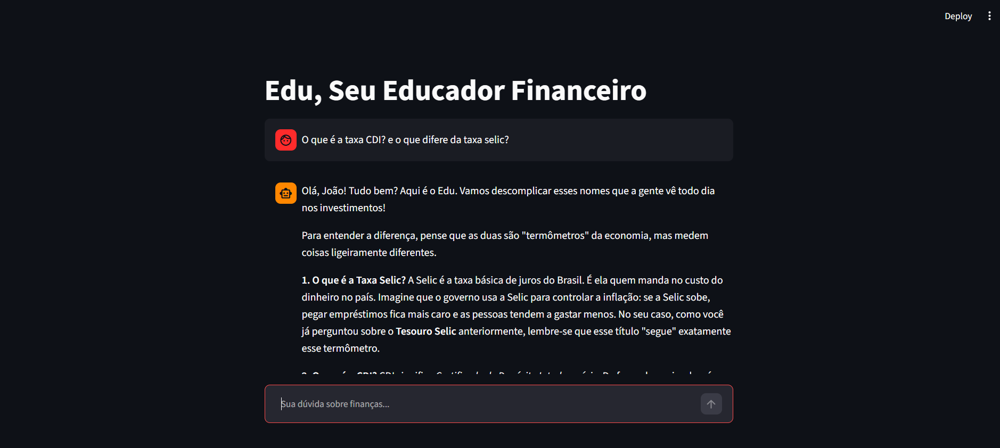

# Código da Aplicação

Todo o código-fonte esta no arquivo `app.py`.

## Setup do Ollama

```bash
# . Instalar Ollama (ollama.com)
# . Foi usado um modelo em cloud (instalação desnecessaria)
# . Modelo usado: gemma4:31b-cloud
# . teste CMD: ollama run gemma4:31b-cloud
```

## Como Rodar

```bash
# Instalar dependências
pip install pandas streamlit requests

# Garantir que Ollama está rodando
ollama server

# Rodar a aplicação
python -m streamlit run ./src/app.py
```

## Evidência de Execução
